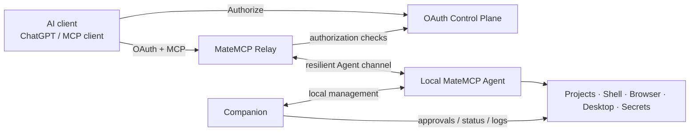

# MateMCP

**Give AI useful access to your computer without handing it an unrestricted machine.**

MateMCP connects MCP-capable AI clients to a local Agent running on your Windows or macOS computer. The Agent can work with project files, shells, browsers, desktop applications, attachments, secrets, and durable project context while MateMCP keeps access scoped, authenticated, observable, and approval-aware.

The normal user experience is simple: install MateMCP Desktop, enroll the device, copy its MCP URL into your AI client, and authorize it with OAuth. You do not copy Agent credentials or expose local ports to the Internet.

## What can MateMCP do?

- **Project-scoped filesystem access** — read and modify files only inside configured projects.
- **Shell and interactive terminal sessions** — run commands, keep long-lived shells, resume output after transient reconnects, and inject approved secrets without revealing them to the AI.
- **Computer Use** — inspect screenshots, interact with browser/native UI, click, type, scroll, and use semantic accessibility actions where supported.
- **Browser automation and visual QA** — navigate applications, inspect responsive layouts, capture screenshots, and support frontend/desktop verification workflows.
- **Secure attachment transfer** — upload conversation files to a selected Agent using bounded, resumable, integrity-checked transfers.
- **Approvals** — require local or remote approval for sensitive actions and keep decisions auditable.
- **Secret Manager** — keep user-managed credentials in the operating system credential store instead of model context or project files.
- **Activity, audit, and diagnostics** — see what the Agent is doing, inspect approval/credential activity, and diagnose connectivity or execution failures.
- **Skills & Memory** — maintain reusable project knowledge and workflow guidance across sessions.
- **Multi-device access** — enroll multiple independently revocable Agents under one account.
- **Resilient connectivity** — logical sessions survive short Agent/Relay disconnects, operations use stable identities, and supported streams/transfers can resume safely.

## How it fits together



The **Relay** carries remote MCP traffic to the correct online Agent. The **Control Plane** handles accounts, Agent ownership, OAuth, authorization, and remote approval coordination. The **Agent** performs work locally. The **Companion** gives the user a native view of status, approvals, shells, secrets, activity, diagnostics, updates, and Agent lifecycle controls.

## Trust and security model

MateMCP is designed to be a boundary between an AI and the user's computer, not a tunnel around local security.

- Every Agent has a random public ID and a separate high-entropy private credential.
- Agent credentials and user-managed secrets are stored in **macOS Keychain** or **Windows Credential Manager**.
- The MCP URL identifies an Agent; it is not itself the Agent's secret credential.
- OAuth tokens are bound to the user, Agent/resource, and granted scopes. Access tokens can be refreshed without repeatedly asking the user to reconnect.
- Filesystem access stays inside configured project roots.
- `mcp:read`, `mcp:write`, and `mcp:shell` capabilities are enforced rather than inferred from the URL.
- Sensitive actions can require explicit approval; approvals and credential use are auditable.
- The Relay never needs the user's OS secrets.
- Attachment transfers are approved, bounded, resumable, and optionally SHA-256 verified.
- Agent and Relay reconnects use stable session/operation identities to reduce duplicate side effects after transient failures.

See [`docs/security.md`](docs/security.md) and [`docs/approval.md`](docs/approval.md) for the detailed model.

## Quick start

1. **Install MateMCP Desktop** for your computer using one of the commands below.
2. Open Companion and finish **device enrollment** if prompted.
3. Copy the Agent's unique MCP URL, for example `https://relay.matemcp.com/mcp/agt_...`.
4. Add that URL to an MCP-capable AI client. ChatGPT is the primary field-tested client today.
5. Complete OAuth with the same MateMCP account that owns the Agent.
6. Try a safe first task, such as asking the AI to list a configured project or inspect a file.
7. Review approvals in Companion when a sensitive operation requires consent.

> **After an Agent update that adds or changes MCP tools:** some clients can retain a previous tool snapshot. For ChatGPT, see [ChatGPT MCP tool refresh after Agent updates](docs/chatgpt-tool-refresh.md).

## Install / upgrade MateMCP Desktop

### macOS

For Apple Silicon Macs:

```bash
curl -fsSL https://raw.githubusercontent.com/vrassouli/MateMCP/main/scripts/bootstrap-macos.sh | bash
```

The bootstrap installs or upgrades **Agent + Companion** in place, starts the Agent, opens Companion for interactive setup when needed, and preserves existing configuration and secure credentials.

Manual package: [MateMCP Desktop for macOS Apple Silicon](https://github.com/vrassouli/MateMCP/releases/download/agent-latest/MateMCP-Desktop-macos-arm64.tar.gz) · [latest stable release](https://github.com/vrassouli/MateMCP/releases/tag/agent-latest)

The Agent runs as a per-user LaunchAgent. Companion is installed under `~/Applications/MateMCP Agent Companion.app`. Private configuration lives under `~/Library/Application Support/MateMCP`; credentials and secrets use macOS Keychain.

Computer Use requires the relevant macOS Accessibility and Screen Recording permissions. Production signing/TCC identity hardening is still being improved, so development/ad-hoc builds may require permissions to be granted again after some updates.

### Windows

Run from PowerShell:

```powershell
irm https://raw.githubusercontent.com/vrassouli/MateMCP/main/scripts/bootstrap-windows.ps1 | iex
```

On Windows x64 the bootstrap installs or upgrades **Agent + Companion**, starts the background Agent, opens Companion when interactive setup is needed, and preserves the user-scoped configuration and credentials.

Manual package: [MateMCP Desktop for Windows x64](https://github.com/vrassouli/MateMCP/releases/download/agent-latest/MateMCP-Desktop-win-x64.zip) · [latest stable release](https://github.com/vrassouli/MateMCP/releases/tag/agent-latest)

Private configuration lives under `%APPDATA%\MateMCP`; enrolled credentials and secrets use Windows Credential Manager.

## Platform status

| Platform | Agent | Native Companion | Computer Use / visual support | Notes |
| --- | --- | --- | --- | --- |
| macOS Apple Silicon | ✅ | ✅ | ✅ | Native desktop semantic actions and visual workflows; macOS permissions required. |
| macOS Intel | ✅ | Agent-only package | Partial | Companion is not currently published for Intel Mac. |
| Windows x64 | ✅ | ✅ | ✅ | Native Windows Graphics Capture preview plus screenshot fallback. |
| Windows ARM64 | ✅ | Agent-only package | Partial | Native WGC helper is not yet shipped for ARM64; screenshot fallback remains available. |

ChatGPT is the primary end-to-end tested remote MCP client. MateMCP uses standards-based MCP/OAuth interfaces and is intended to work with other compatible clients, but interoperability can vary between providers; client-specific compatibility is tracked and tested separately.

## Companion at a glance

Companion is the user's local control surface. Current functionality includes:

- Agent **Start / Stop / Restart** and status.
- MCP endpoint visibility and copy actions.
- Pending **Approvals** and policy management.
- **Interactive Shell** sessions.
- **Secret Manager** backed by the OS credential store.
- **Activity & Audit** history.
- **Agent Logs** and diagnostics.
- **Skills & Memory** inspection and management.
- **Computer Use** preview/status.
- **Prevent Sleep While Using** controls.
- Manual update checks and optional automatic Desktop updates on supported platforms.

## Self-host API + Relay

For the usual single-server deployment there is one canonical install/update command:

```bash
curl -fsSL https://raw.githubusercontent.com/vrassouli/MateMCP/main/deploy/install.sh | sudo bash
```

The installer is update-safe: it preserves existing configuration, asks only for missing setup values, refreshes the current Compose definitions, pulls/recreates the server components, keeps the private API↔Relay credential synchronized, and health-checks both services before reporting success. On supported Debian/Ubuntu hosts it can bootstrap Docker Engine + Compose when needed.

Use component installers only for advanced deployments where API and Relay are managed separately:

```bash
# API / Control Plane
curl -fsSL https://raw.githubusercontent.com/vrassouli/MateMCP/main/deploy/api/install.sh | sudo bash

# Relay
curl -fsSL https://raw.githubusercontent.com/vrassouli/MateMCP/main/deploy/relay/install.sh | sudo bash
```

The API supports SQLite for a small single-server deployment and SQL Server for external database deployments. API and Relay should sit behind HTTPS reverse proxies; their container ports should not be exposed directly to the Internet.

Relay reverse-proxy guidance is in [`deploy/relay/README.md`](deploy/relay/README.md), including the example Nginx configuration and graceful-drain settings.

## Documentation

| Topic | Documentation |
| --- | --- |
| Architecture | [`docs/architecture.md`](docs/architecture.md) |
| Security model | [`docs/security.md`](docs/security.md) |
| Approvals | [`docs/approval.md`](docs/approval.md) |
| Agent/platform parity | [`docs/agent-feature-parity.md`](docs/agent-feature-parity.md) |
| Computer Use | [`docs/computer-use.md`](docs/computer-use.md) |
| Desktop control | [`docs/desktop-control.md`](docs/desktop-control.md) |
| macOS semantic actions | [`docs/macos-semantic-actions.md`](docs/macos-semantic-actions.md) |
| Browser visual QA | [`docs/browser-visual-qa.md`](docs/browser-visual-qa.md) |
| Attachment transfer | [`docs/attachment-transfer.md`](docs/attachment-transfer.md) |
| Interactive shell secrets | [`docs/interactive-shell-secrets.md`](docs/interactive-shell-secrets.md) |
| Credential injection | [`docs/credential-injection.md`](docs/credential-injection.md) |
| Connectivity / chaos coverage | [`docs/connectivity-chaos-testing.md`](docs/connectivity-chaos-testing.md) |
| ChatGPT tool refresh | [`docs/chatgpt-tool-refresh.md`](docs/chatgpt-tool-refresh.md) |
| Development workflow | [`docs/development-workflow.md`](docs/development-workflow.md) |
| Roadmap | [`docs/roadmap.md`](docs/roadmap.md) |

## Current limitations and active work

MateMCP is under active development. Some areas intentionally remain conservative or are still being hardened:

- Native Companion packaging is currently focused on Windows x64 and macOS Apple Silicon.
- Windows ARM64 uses screenshot fallback rather than the native WGC preview helper.
- macOS production signing/TCC identity still needs hardening so permissions survive every production update reliably.
- Skills & Memory exists today, but proactive automatic context use across different AI clients is still evolving.
- Third-party MCP/OAuth clients can have provider-specific interoperability differences and need real external validation.
- Safe & Informed Approvals is being expanded so approval dialogs explain consequences and risk rather than relying only on raw command syntax.

## Releases

`main` is the source of truth for stable development. The moving [`agent-latest`](https://github.com/vrassouli/MateMCP/releases/tag/agent-latest) release contains current stable Agent packages and native Desktop packages for supported architectures. Version tags such as `v0.1.0` publish versioned release assets.

Contributions and field-test reports are welcome through GitHub Issues and Pull Requests.
